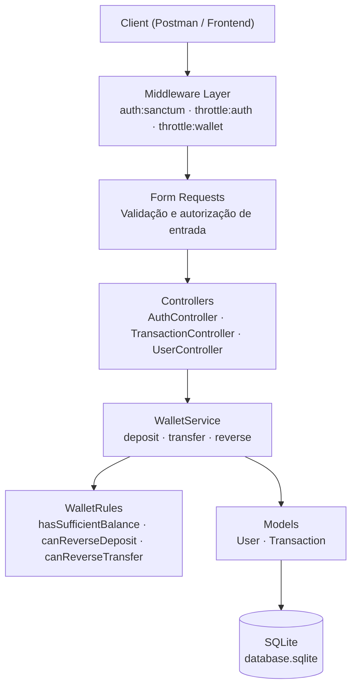
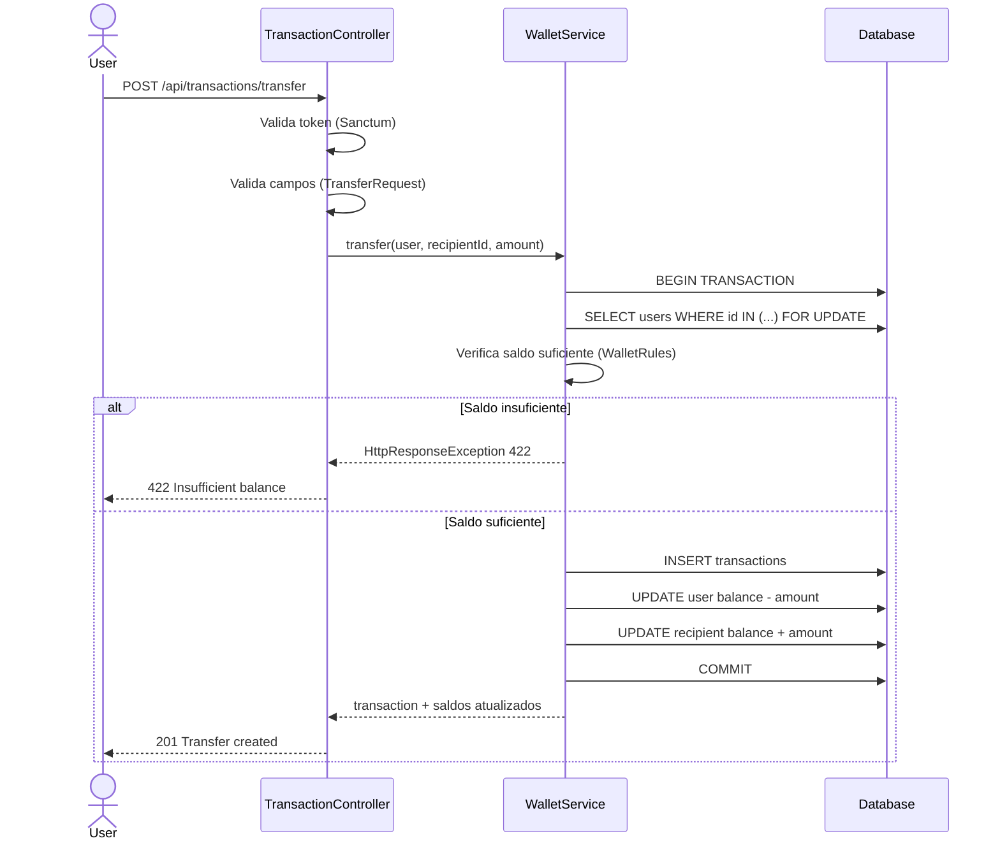
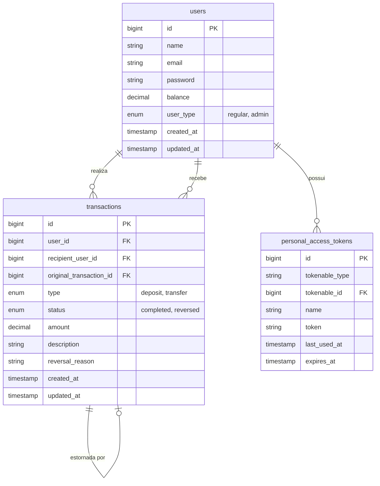

# Cobuccio Wallet API

Sistema de carteira digital desenvolvido em Laravel 13, com autenticação por token, depósitos, transferências entre usuários e estorno de transações.

O projeto é composto por uma API REST que pode ser consumida por qualquer cliente HTTP (Postman, app mobile, frontend web, etc.). A pasta `web/` está reservada para uma futura interface frontend.

---

## Como funciona

O sistema permite que usuários se cadastrem, façam login, movimentem saldo em suas carteiras e consultem seu histórico de transações.

Cada usuário possui:

- Uma conta identificada por e-mail e senha
- Um saldo em carteira (`balance`)
- Um tipo de conta: `regular` (padrão) ou `admin`

As operações financeiras disponíveis são:

| Operação          | Descrição                                            |
| ----------------- | ---------------------------------------------------- |
| **Depósito**      | O usuário adiciona saldo à própria carteira          |
| **Transferência** | O usuário envia saldo para outro usuário             |
| **Estorno**       | Cancela uma transação anterior, devolvendo os saldos |

Toda operação financeira gera um registro na tabela `transactions`, que mantém o histórico completo. Um estorno cria uma nova transação vinculada à original.

---

## Tech Stack

| Camada                   | Tecnologia                     |
| ------------------------ | ------------------------------ |
| Linguagem                | PHP 8.3                        |
| Framework                | Laravel 13                     |
| Autenticação             | Laravel Sanctum (Bearer Token) |
| Banco de dados (runtime) | SQLite via Docker              |
| Banco de dados (testes)  | SQLite in-memory               |
| Containers               | Docker + Laravel Sail          |
| CI                       | GitHub Actions                 |

---

## Arquitetura

### Camadas da aplicação

O fluxo de uma requisição passa pelas seguintes camadas:



**Responsabilidades de cada camada:**

- **Middleware**: autentica o token Sanctum e aplica rate limiting (rotas de auth: 10 req/min; rotas de carteira: 60 req/min).
- **Form Requests**: valida os campos da requisição antes de chegar no controller. Retorna 422 automaticamente se inválido.
- **Controllers**: coordenam a requisição — extraem os dados validados, chamam o service e formatam a resposta JSON.
- **WalletService**: contém toda a lógica de negócio financeira. Executa operações dentro de transações de banco de dados atômicas.
- **WalletRules**: regras de negócio puras (sem efeitos colaterais) — verificam saldo, permissões de estorno, etc.
- **Models**: mapeiam as tabelas `users` e `transactions` e definem os relacionamentos Eloquent.

---

### Fluxo de uma transferência



O `SELECT ... FOR UPDATE` garante que dois saques simultâneos da mesma conta não passem pela verificação de saldo ao mesmo tempo (proteção contra race condition).

---

### Modelo de dados



---

## Como rodar o projeto

### Pré-requisitos

- [Docker Desktop](https://www.docker.com/products/docker-desktop/) instalado e rodando
- PHP 8.3+ e Composer (apenas para instalar dependências antes do Sail)

### Passo a passo

1. Entre na pasta da API:

```bash
cd api
```

2. Instale as dependências:

```bash
composer install
```

3. Crie o arquivo de ambiente:

```bash
cp .env.example .env
```

4. Gere a chave da aplicação:

```bash
./vendor/bin/sail artisan key:generate
```

5. Suba os containers:

```bash
./vendor/bin/sail up -d
```

6. Execute as migrations:

```bash
./vendor/bin/sail artisan migrate
```

7. A API estará disponível em: **http://localhost:8080**

> Por padrão, o projeto usa SQLite dentro do container. Nenhuma configuração de banco de dados extra é necessária.

---

## Testando com Postman

A pasta `api/postman/` contém:

- `postman-collection.json` — coleção com todos os endpoints configurados
- `postman-environment-local.json` — variáveis de ambiente para rodar localmente

**Para importar:**

1. Abra o Postman
2. Importe o arquivo de coleção
3. Importe o arquivo de ambiente e selecione como ambiente ativo
4. Execute **Register User 1** → **Login User 1** (o token é salvo automaticamente)
5. As demais rotas já usam o token automaticamente via `{{access_token}}`

---

## Testes automatizados

```bash
./vendor/bin/sail artisan test
```

Os testes usam SQLite in-memory — nenhum dado do banco real é afetado.

---

## CI

O GitHub Actions executa os testes automaticamente a cada push ou pull request para `main`.

Arquivo: `.github/workflows/laravel-ci.yml`

---

## Documentação da API

Para detalhes sobre cada endpoint, parâmetros, validações e exemplos de resposta, consulte [api/README.md](api/README.md).
