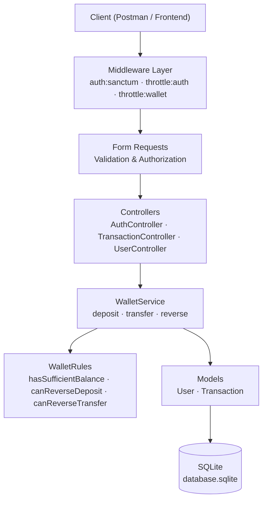
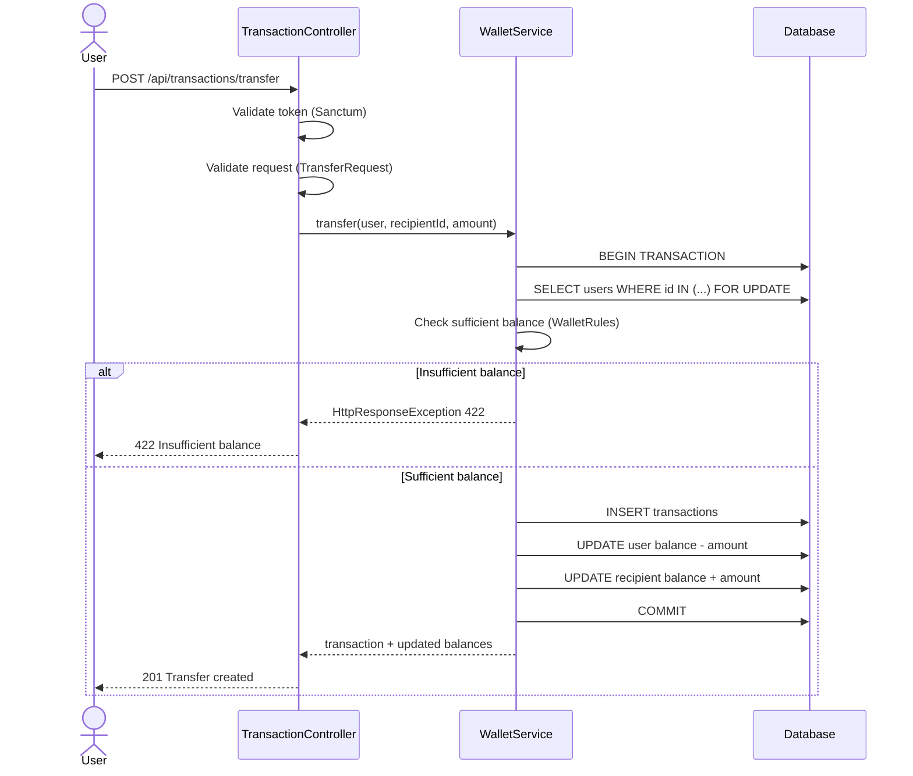
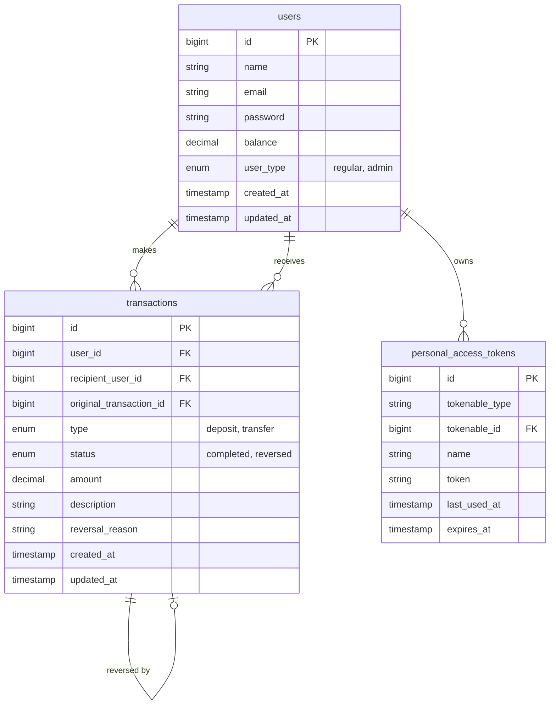

# Cobuccio Wallet API

REST API for a digital wallet system built with Laravel 13.

The project covers:

- User registration and authentication using Sanctum tokens.
- Wallet deposits.
- Transfers between users.
- Transfer and deposit reversal with authorization rules.
- Basic automated coverage for core transaction flows.

## Tech Stack

- PHP 8.3
- Laravel 13
- SQLite (runtime via Docker)
- SQLite in-memory (tests)
- Laravel Sanctum (token auth)
- GitHub Actions (CI)

## Architecture

### Layer Diagram



### Transfer Flow



### Data Model



## Setup

### With Docker (recommended)

1. Install dependencies:

```bash
composer install
```

2. Create environment file:

```bash
cp .env.example .env
```

3. Generate app key:

```bash
./vendor/bin/sail artisan key:generate
```

4. Start containers:

```bash
./vendor/bin/sail up -d
```

5. Run migrations:

```bash
./vendor/bin/sail artisan migrate
```

6. Access the API at `http://localhost:8080`

### Without Docker

1. Install dependencies and configure `.env` with `DB_CONNECTION=sqlite`.
2. Run `php artisan key:generate && php artisan migrate && php artisan serve`.

## Authentication

The API uses Bearer tokens generated by Laravel Sanctum.

Send token in protected requests:

```http
Authorization: Bearer <token>
```

## Business Rules

- A user must have enough balance before transferring funds.
- A transfer cannot be sent to the same authenticated user.
- Reversal is allowed only for admin users or the original transaction owner.
- A transaction cannot be reversed twice.

## API Endpoints

### Auth

- `POST /api/auth/register`
- `POST /api/auth/login`
- `GET /api/auth/me` (protected)
- `POST /api/auth/logout` (protected)

### User

- `GET /api/user` (protected)
- `GET /api/user/balance` (protected)

### Transactions

- `POST /api/transactions/deposit` (protected)
- `POST /api/transactions/transfer` (protected)
- `POST /api/transactions/reverse` (protected)
- `GET /api/transactions` (protected)
- `GET /api/transactions/{transaction}` (protected)

## Request Examples

### Register

```json
{
    "name": "John Doe",
    "email": "john@example.com",
    "password": "password123",
    "password_confirmation": "password123"
}
```

### Login

```json
{
    "email": "john@example.com",
    "password": "password123"
}
```

### Deposit

```json
{
    "amount": 150.75,
    "description": "Wallet top-up"
}
```

### Transfer

```json
{
    "recipient_id": 2,
    "amount": 40.0,
    "description": "Transfer to friend"
}
```

### Reverse Transaction

```json
{
    "transaction_id": 10,
    "reason": "Requested by user"
}
```

## Running Tests

```bash
php artisan test
```

The PHPUnit configuration uses SQLite in-memory for deterministic and fast test execution.

## CI

GitHub Actions workflow runs tests on push and pull requests to `main`:

- Workflow file: `.github/workflows/laravel-ci.yml`
